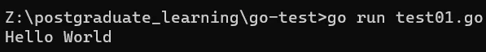
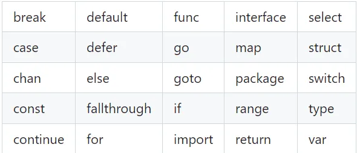

## 1. 环境安装
[https://golang.google.cn/dl/](https://golang.google.cn/dl/)

安装会自动将`Go/bin`添加到环境变量。

**测试**

在工作目录中创建`test.go`文件。
```python
package main

import "fmt"

func main() {
   fmt.Println("Hello, World!")
}
```
打开命令窗口，输入`go run test.go`


## 2. 基本结构和基本数据类型
### 2.1 文件名、关键字与标识符

**文件名**

Go 的**源文件均由小写字母组成**，如`scanner.go`。如果文件名由多个部分组成，则使用下划线`_`对它们进行分隔，如`scanner_test.go`。

**关键字**


Go 语句无需`;`结尾。
## 2、Go 程序的基本结构和要素
### (1) 包的概念、导入与可见性
每个 Go 文件都属于且仅属于一个包。一个包可以由许多以`.go`为扩展名的源文件组成，因此文件名和包名一般来说都是不相同的。
你必须在源文件中非注释的第一行指明这个文件属于哪个包，如：`package main`。`package main`表示一个可独立执行的程序，每个 Go 应用程序都包含一个名为`main`的包。
所有的**包名都应该使用小写字母**。
**标准库**
在 Go 的安装文件里包含了一些可以直接使用的包，即标准库。一般情况下，标准包会存放在 `$GOROOT/pkg/$GOOS_$GOARCH/`目录下。
**包的编译**
如果想要构建一个程序，则包和包内的文件都必须以正确的顺序进行编译。包的依赖关系决定了其构建顺序。属于同一个包的源文件必须全部被一起编译，**一个包即是编译时的一个单元**，因此根据惯例，每个目录都只包含一个包。**如果对一个包进行更改或重新编译，所有引用了这个包的客户端程序都必须全部重新编译。**
Go 中的包模型采用了显式依赖关系的机制来达到快速编译的目的，编译器会从后缀名为`.o`的对象文件（需要且只需要这个文件）中提取传递依赖类型的信息。
如果`A.go`依赖`B.go`，而`B.go`又依赖`C.go`：

- 编译`C.go`, `B.go`, 然后是`A.go`.
- 为了编译`A.go`, 编译器读取的是`B.o`而不是`C.o`.

这种机制对于编译大型的项目时可以显著地提升编译速度。
**包的链接**
一个 Go 程序是通过`import`关键字将一组包链接在一起。
通过如下代码导入多个包：
```go
import (
    "fmt"
    "os"
)
```
**包内对象的可见性规则——大写可见、小写不可见**
当标识符（包括常量、变量、类型、函数名、结构字段等等）以一个大写字母开头，如：`Group1`，那么使用这种形式的标识符的对象就可以被外部包的代码所使用（客户端程序需要先导入这个包），这被称为导出（像面向对象语言中的`public`）；标识符如果以小写字母开头，则对包外是不可见的，但是它们在整个包的内部是可见并且可用的（像面向对象语言中的`private`）。
```go
package main

import fm "fmt" // alias3

func main() {
   fm.Println("hello, world")
}
```
你可以在使用`import`导入包之后定义或声明 0 个或多个常量 (const)、变量 (var) 和类型 (type)，这些对象的作用域都是全局的（在本包范围内），所以可以被本包中所有的函数调用，然后声明一个或多个函数 (func)。
### (2) 函数
函数的语法格式如下：
```go
func functionName(parameter_list) (return_value_list) {
   …
}
```
其中：

- `parameter_list`的形式为`(param1 type1, param2 type2, …)`
- `return_value_list`的形式为`(ret1 type1, ret2 type2, …)`

这种多返回值一般用于判断某个函数是否执行成功 (`true`/`false`) 或与其它返回值一同返回错误消息。
只有当某个函数需要被外部包调用的时候才使用大写字母开头，并遵循 Pascal 命名法；否则就遵循骆驼命名法，即第一个单词的首字母小写，其余单词的首字母大写。(导出：`GetUserList`、不导出：`getUserList`)
`main()`函数是每一个可执行程序所必须包含的，一般来说都是在启动后第一个执行的函数（如果有`init()`函数则会先执行该函数）。`main()`函数既没有参数，也没有返回类型（与 C 家族中的其它语言恰好相反）。
### (3) 注释
单行：`//`
多行：
```go
/*
	多行注释
*/
```
每一个包应该有相关注释，在`package`语句之前的块注释将被默认认为是这个包的文档说明，其中应该提供一些相关信息并对整体功能做简要的介绍。一个包可以分散在多个文件中，但是只需要在其中一个进行注释说明即可。当开发人员需要了解包的一些情况时，自然会用`godoc`来显示包的文档说明，在首行的简要注释之后可以用成段的注释来进行更详细的说明，而不必拥挤在一起。另外，在多段注释之间应以空行分隔加以区分。
```go
// Package superman implements methods for saving the world.
//
// Experience has shown that a small number of procedures can prove
// helpful when attempting to save the world.
package superman
```
几乎所有全局作用域的类型、常量、变量、函数和被导出的对象都应该有一个合理的注释。如果这种注释（称为文档注释）出现在函数前面，例如函数`Abcd`，则要以 "Abcd..." 作为开头。
```go
// enterOrbit causes Superman to fly into low Earth orbit, a position
// that presents several possibilities for planet salvation.
func enterOrbit() error {
   ...
}
```
godoc 工具会收集这些注释并产生一个技术文档。
### (4) 类型
使用`var`声明的变量的值会自动初始化为该类型的零值。
类型可以是基本类型，如：`int`、`float`、`bool`、`string`；结构化的（复合的），如：`struct`、`array`、切片 (slice)、`map`、通道 (channel)；只描述类型的行为的，如：`interface`。
结构化的类型没有真正的值，它使用`nil`作为默认值。**Go 语言中不存在类型继承**。
使用`type`关键字可以定义你自己的类型，你可能想要定义一个结构体。如果你有多个类型需要定义，可以使用因式分解关键字的方式。
每个值都必须在经过编译后属于某个类型（编译器必须能够推断出所有值的类型），因为 Go 语言是一种静态类型语言。
### (5) Go 程序的一般结构

- 在完成包的`import`之后，开始对常量、变量和类型的定义或声明。
- 如果存在`init()`函数的话，则对该函数进行定义（这是一个特殊的函数，每个含有该函数的包都会首先执行这个函数）。
- 如果当前包是`main`包，则定义`main()`函数。
- 然后定义其余的函数，首先是类型的方法，接着是按照`main()`函数中先后调用的顺序来定义相关函数，如果有很多函数，则可以按照字母顺序来进行排序。
```go
package main

import (
   "fmt"
)

const c = "C"

var v int = 5

type T struct{}

func init() { // initialization of package
}

func main() {
   var a int
   Func1()
   // ...
   fmt.Println(a)
}

func (t T) Method1() {
   //...
}

func Func1() { // exported function Func1
   //...
}
```
### (6) 类型转换
由于 Go 语言不存在隐式类型转换，因此所有的转换都必须显式说明，就像调用一个函数一样（类型在这里的作用可以看作是一种函数）：`valueOfTypeB = typeB(valueOfTypeA)`
```go
a := 5.0
b := int(a)
```
具有相同底层类型的变量之间可以相互转换：
```go
type IZ int

var a IZ = 5
c := int(a)
d := IZ(c)
```
### (7) Go 命名规范
名称不需要指出自己所属的包，因为在调用的时候会使用包名作为限定符。
返回某个对象的函数或方法的名称一般都是使用名词，没有`Get...`之类的字符，如果是用于修改某个对象，则使用`SetName()`。
有必须要的话可以使用大小写混合的方式，如`MixedCaps()`或`mixedCaps()`，而不是使用下划线来分割多个名称。
## 3、常量
常量使用关键字`const`定义，用于存储不会改变的数据。存储在常量中的数据类型只可以是**布尔型**、数字型（整数型、浮点型和复数）和字符串型。
常量的定义格式：`const identifier [type] = value`
```go
const pi = 3.14
const str string = "zhangsan"
```
可以省略类型说明符`[type]`，因为编译器可以根据变量的值来推断其类型。
常量的值必须是能够在编译时就能够确定的；你可以在其赋值表达式中涉及计算过程，但是所有用于计算的值必须在编译期间就能获得。**在编译期间自定义函数均属于未知，因此无法用于常量的赋值，但内置函数可以使用，如：**`**len()**`**。**
```go
// 正确用法
const age = 2 / 3
// 错误用法
const c2 = getNumber()
```
数字型的常量是没有大小和符号的，并且可以使用任何精度而不会导致溢出。
常量的并行赋值：
```go
const Monday, Tuesday, Wednesday, Thursday, Friday, Saturday = 1, 2, 3, 4, 5, 6
const (
	Monday, Tuesday, Wednesday = 1, 2, 3
	Thursday, Friday, Saturday = 4, 5, 6
)
```
常量用作枚举：
```go
const (
	Unknown = 0
	Male = 1
	Female = 2
)
```
## 4、变量
**变量的声明**
声明变量的一般形式是使用`var`关键字：`var identifier type`。
```go
var a int
var b bool
var str string
var a, b, c int*

// 因式分解关键字的写法一般用于声明全局变量
var (
    a int
    b bool
    str string
)
```
当一个变量被声明之后，系统自动赋予它该类型的零值：`int`为`0`，`float32(64)`为`0.0`，`bool`为`false`，`string`为空字符串，指针为`nil`。所有的变量在 Go 中都是经过初始化的。
**变量的命名规则**
变量的命名规则遵循**驼峰命名法**，即首个单词小写，每个新单词的首字母大写，例如：`numShips`和 `startDate`。但如果你的全局变量希望能够被外部包所使用，则需要将首个单词的首字母也大写。
**变量的作用域**
一个变量（常量、类型或函数）在程序中都有一定的作用范围，称之为作用域。如果一个变量在函数体外声明，则被认为是全局变量，可以在整个包甚至外部包（被导出后）使用，不管你声明在哪个源文件里或在哪个源文件里调用该变量。
变量可以编译期间就被赋值，赋值给变量使用运算符等号`=`，当然你也可以在运行时对变量进行赋值操作。
在函数体内声明局部变量，最好使用`a := 6`的形式。这被称为初始化声明。
```go
package main

import (
	"fmt"
   "runtime"
	"os"
)

func main() {
    // 获取操作系统
	var goos string = runtime.GOOS
	fmt.Printf("The operating system is: %s\n", goos)
    // 获取环境变量
	path := os.Getenv("PATH")
	fmt.Printf("Path is %s\n", path)
}
```
**值类型和引用类型**
所有像`int`、`float`、`bool`和`string`这些基本类型都属于值类型，使用这些类型的变量直接指向存在内存中的值。另外，像数组和结构这些复合类型也是值类型。
当使用等号`=`将一个变量的值赋值给另一个变量时，如：`j = i`，实际上是在内存中将`i`的值进行了拷贝：

你可以通过`&i`来获取变量`i`的内存地址：
```go
package main

import "fmt"

func main() {
	a := 6
	b := a
	fmt.Println(a == b)
	fmt.Println(&a == &b)
}

// 输出结果：true、false
```
一个引用类型的变量`r1`存储的是`r1`的值所在的内存地址（数字），或内存地址中第一个字所在的位置。

这个内存地址被称之为指针。
在 Go 语言中，指针属于引用类型，其它的引用类型还包括`slices`，`maps`和`channel`。被引用的变量会存储在堆中，以便进行垃圾回收，且比栈拥有更大的内存空间。
**打印**
函数`fmt.Print`和`fmt.Println`会自动使用格式化标识符`%v`对字符串进行格式化，两者都会在每个参数之间自动增加空格，例如：
```go
fmt.Print("Hello:", 23)

// 将会输出：Hello: 23
```
**变量赋值**
可以使用`a, b, c = 5, 7, "abc"`或`a, b, c := 5, 7, "abc"`进行多变量并行赋值。
交换值：`a, b = b, a`。
空白标识符`_`也被用于抛弃值，如值`5`在：`_, b = 5, 7`中被抛弃。
`_`实际上是一个只写变量，你不能得到它的值。这样做是因为 Go 语言中你必须使用所有被声明的变量，但有时你并不需要使用从一个函数得到的所有返回值。
`**init()**`**函数**
变量除了可以在全局声明中初始化，也可以在`init()`函数中初始化。这是一类非常特殊的函数，它不能够被人为调用，而是在每个包完成初始化后自动执行，并且执行优先级比`main()`函数高。
每个源文件可以包含多个`init()`函数，同一个源文件中的`init()`函数会按照从上到下的顺序执行，如果一个包有多个源文件包含`init()`函数的话，则官方鼓励但不保证以文件名的顺序调用。初始化总是以单线程并且按照包的依赖关系顺序执行。
一个可能的用途是在开始执行程序之前对数据进行检验或修复，以保证程序状态的正确性。
## 5、基本类型与运算符
### (1) 布尔类型`bool`
两个类型相同的值可以使用相等`==`或者不等`!=`运算符来进行比较并获得一个布尔型的值。
Go 对于值之间的比较有非常严格的限制，只有两个类型相同的值才可以进行比较，如果值的类型是接口，它们也必须都实现了相同的接口。如果其中一个值是常量，那么另外一个值的类型必须和该常量类型相兼容的。如果以上条件都不满足，则其中一个值的类型必须在被转换为和另外一个值的类型相同之后才可以进行比较。
`&&`、`||`。
在格式化输出时，你可以使用`%t`来表示你要输出的值为布尔型。
### (2) 数字类型
Go 也有**基于架构的类型**，例如：`int`、`uint`和`uintptr`。
这些类型的长度都是根据运行程序所在的操作系统类型所决定的：
`int`和`uint`在 32 位操作系统上，它们均使用 32 位（4 个字节），在 64 位操作系统上，它们均使用 64 位（8 个字节）。
`uintptr`的长度被设定为足够存放一个指针即可。
Go 语言中没有 float 类型。（Go语言中只有 float32 和 float64）没有 double 类型。

尽可能地使用`float64`，因为`math`包中所有有关数学运算的函数都会要求接收这个类型。
你可以通过增加前缀`0`来表示 8 进制数（如：`077`），增加前缀`0x`来表示 16 进制数（如：`0xFF`），以及使用 e 来表示 10 的连乘（如： 1e3 = 1000，或者 6.022e23 = 6.022 x 1e23）。
在格式化字符串里，`%d`用于格式化整数（`%x`和`%X`用于格式化 16 进制表示的数字），`%g`用于格式化浮点型（`%f`输出浮点数，`%e`输出科学计数表示法），`%0nd`用于规定输出长度为 n 的整数，其中开头的数字 0 是必须的。
Go 中拥有以下逻辑运算符：`==`、`!=`、`<`、`<=`、`>`、`>=`。
算术运算符：`+`、`-`、`*`、`/`、`++`、`--`
包`unicode`包含了一些针对测试字符的非常有用的函数（其中 ch 代表字符）：

- 判断是否为字母：`unicode.IsLetter(ch)`
- 判断是否为数字：`unicode.IsDigit(ch)`
- 判断是否为空白符号：`unicode.IsSpace(ch)`

这些函数返回单个布尔值。
### (3) 类型别名——`type`
使用语法：`type CUSTOM_TYPE_NAME int`
```go
package main

import "fmt"
// 使用 type 给类型起别名
type TZ int
type Rope string

func main() {
	var a, b TZ = 3, 4
	c := a + b
	var rope Rope = "绳子"
	fmt.Printf("和为：%d\n", c)
	fmt.Println(rope)
}
```
类型别名得到的新类型并非和原类型完全相同，新类型不会拥有原类型所附带的方法。
### (4) 字符类型
字符只是整数的特殊用例。`byte`类型是`uint8`的别名，`rune`类型是`unit16`的别名。格式化说明符 `%c`用于表示字符。
## 6、字符串
字符串是 UTF-8 字符的一个序列，字符串是一种**值类型**，且值不可变，即创建某个文本后你无法再次修改这个文本的内容；更深入地讲，字符串是字节的定长数组。`string`类型的零值为长度为零的字符串，即空字符串`""`。一般的比较运算符（`==`、`!=`、`<`、`<=`、`>=`、`>`）通过在内存中按字节比较来实现字符串的对比。获取字符串中某个字节的地址的行为是非法的，例如：`&str[i]`。
可以通过函数`len()`来获取字符串所占的字节长度，例如：`len(str)`。
## 7、`strings`和`strconv`包
Go 中使用`strings`包来完成对字符串的主要操作。
`strings`包中包括判断前后缀、判断包含关系、子串在父串中的索引、字符串替换、统计字符串出现次数、修改字符串大小写、字符串修剪、字符串分割、字符串拼接。
```go
package main

import (
	"fmt"
	"strings"
)

func main() {
	str := "波尔布特疑似有点太极端了"
	subStr := "波尔布特"

	// 前缀与后缀
	fmt.Println(strings.HasPrefix(str, subStr))
	fmt.Println(strings.HasSuffix(str, "了"))

	// 包含
	fmt.Println(strings.Contains(str, subStr))

	// 替换
	fmt.Println(strings.Replace(str, subStr, "祖波人", -1))

	// 出现次数统计
	fmt.Println(strings.Count(str, subStr))

	// 重复字符串
	fmt.Println(strings.Repeat(str, 3))
}
```
与字符串相关的类型转换都是通过`strconv`包实现的。
## 8、时间和日期
`time`包为我们提供了一个数据类型`time.Time`（作为值使用）以及显示和测量时间和日期的功能函数。当前时间可以使用`time.Now()`获取，使用`t.Day()`、`t.Minute()`等等来获取时间的一部分。
## 9、指针
Go 中无法进行指针运算。**一个指针变量可以指向任何一个值的内存地址。**它指向那个值的内存地址，在 32 位机器上占用 4 个字节，在 64 位机器上占用 8 个字节，并且与它所指向的值的大小无关。指针的格式化标识符为`%p`。符号`*`可以放在一个指针前，如`*intP`，那么它将得到这个指针指向地址上所存储的值，这被称为反引用（或者内容或者间接引用）操作符。
一个指针变量通常缩写为`ptr`。
# 三、控制结构
Go 提供了下面这些条件结构和分支结构：

- if-else 结构
- switch 结构
- select 结构

可以使用迭代或循环结构来重复执行一次或多次某段代码（任务）：

- for (range) 结构

一些如`break`和`continue`这样的关键字可以用于中途改变循环的状态。
此外，你还可以使用`return`来结束某个函数的执行，或使用`goto`和标签来调整程序的执行位置。
Go 完全省略了`if`、`switch`和`for`结构中条件语句两侧的括号，相比 Java、C++ 和 C# 中减少了很多视觉混乱的因素，同时也使你的代码更加简洁。
## 1、if-else
```go
if condition {
    // do something	
}
```
```go
if condition {
	// do something	
} else {
	// do something	
}
```
```go
if condition1 {
	// do something	
} else if condition2 {
	// do something else	
} else {
	// catch-all or default
}
```
即使当代码块之间只有一条语句时，大括号也不可被省略。
关键字`if`和`else`之后的左大括号`{`必须和关键字在同一行，如果你使用了`else-if`结构，则前段代码块的右大括号`}`必须和`else-if`关键字在同一行。
`if`可以包含一个初始化语句，使用简短方式`:=`声明的变量的作用域只存在于 if 结构中（在 if 结构的大括号之间，如果使用 if-else 结构则在 else 代码块中变量也会存在）。如果变量在 if 结构之前就已经存在，那么在 if 结构中，该变量原来的值会被隐藏。
```go
if initialization; condition {
	// do something
}
```
```go
package main

import (
	"fmt"
	"runtime"
)

func main() {
	if os := runtime.GOOS; os == "windows" {
		fmt.Println("都什么年代了，还在用传统windows")
	}
}
```
使用`if`判断错误的产生：
```go
value, err := pack1.Function1(param1)
if err != nil {
	fmt.Printf("An error occured in pack1.Function1 with parameter %v", param1)
	return err
}
// 未发生错误，继续执行
```
## 2、switch
```go
switch var1 {
	case val1:
		...
	case val2:
		...
	default:
		...
}
```
前花括号`{`必须和`switch`关键字在同一行。不需要特别使用`break`语句来表示结束。程序也不会自动地去执行下一个分支的代码。如果在执行完每个分支的代码后，还希望继续执行后续分支的代码，可以使用`fallthrough`关键字来达到目的。
Go 的`switch`比较灵活：
```go
switch {
	case i < 0:
		f1()
	case i == 0:
		f2()
	case i > 0:
		f3()
}
```
初始化并判断：
```go
switch initialization {
	case val1:
		...
	case val2:
		...
	default:
		...
}
```
```go
package main

import "fmt"

func main() {
	var outputStr string

	switch isExtreme := 1; {
		case isExtreme == 0:
			outputStr = "波尔布特疑似有点太极端了"
		case isExtreme == 1:
			outputStr = "波尔布特疑似有点太城市化了"
		default:
			outputStr = "祖波人"
	}

	fmt.Println(outputStr)
}
```
## 3、for
想要重复执行某些语句，Go 语言中只有`for`结构可以使用。
### (1) 基于计数器的迭代
```go
for 初始化语句; 条件语句; 修饰语句 {}
```
```go
package main

import "fmt"

func main() {
	for i := 0; i < 5; i++ {
		fmt.Printf("This is the %d iteration\n", i)
	}
}
```
同样的，左花括号`{`必须和`for`语句在同一行，计数器的生命周期在遇到右花括号`}`时便终止。一般习惯使用`i`、`j`、`z`或`ix`等较短的名称命名计数器。
永远不要在循环体内修改计数器，这在任何语言中都是非常差的实践！
### (2) 基于条件判断的迭代
```go
package main

import "fmt"

func main() {
	var i int = 5

	for i >= 0 {
		i = i - 1
		fmt.Printf("The variable i is now: %d\n", i)
	}
}
```
### (3) for-range
```go
for ix, val := range coll { }
```
```go
for pos, char := range str {
...
}
```
## 4、标签与`goto`
不鼓励使用标签和`goto`语句。
如果您必须使用`goto`，应当只使用正序的标签（标签位于`goto`语句之后），但注意标签和`goto`语句之间不能出现定义新变量的语句，否则会导致编译失败。
# 四、函数
好的程序是非常注意 DRY 原则的，即不要重复你自己 (Don't Repeat Yourself)，意思是执行特定任务的代码只能在程序里面出现一次。
Go 里面有三种类型的函数：

- 普通的带有名字的函数
- 匿名函数或者lambda函数
- 方法（Methods）
```go
func g() {
}
```
Go 中不允许函数重载。
## 1、函数参数与返回值
多值返回是 Go 的一大特性。
:::info
没有参数的函数通常被称为 niladic 函数（niladic function）
:::
### (1) 值传递和引用传递
Go 默认使用按值传递来传递参数，也就是传递参数的副本。函数接收参数副本之后，在使用变量的过程中可能对副本的值进行更改，但不会影响到原来的变量，比如 `Function(arg1)`。
如果你希望函数可以直接修改参数的值，而不是对参数的副本进行操作，你需要将参数的地址（变量名前面添加`&`符号，比如`&variable`）传递给函数，这就是按引用传递，比如 `Function(&arg1)`，此时传递给函数的是一个指针。如果传递给函数的是一个指针，指针的值（一个地址）会被复制，但指针的值所指向的地址上的值不会被复制；我们可以通过这个指针的值来修改这个值所指向的地址上的值。几乎在任何情况下，传递指针（一个32位或者64位的值）的消耗都比传递副本来得少。
在函数调用时，像切片 (slice)、字典 (map)、接口 (interface)、通道 (channel) 这样的引用类型都是默认使用引用传递（即使没有显式的指出指针）。
使用案例：
```go
package main

import "fmt"

func main() {
	a, b, c := 5, 5, 10
	changeReply(a, b, &c)
	fmt.Printf("当前值为：%d\n", c)

}

func changeReply(a, b int, reply *int) {
	*reply = a + b
}
```
### (2) 命名的返回值
结果形参会被初始化为相应类型的零值，可直接在函数中使用，需要返回时直接使用`return`语句即可。
```go
package main

import "fmt"

func main() {
	// var sum, multiply, minus = doArithmetic(1, 2)
	// fmt.Println(sum, multiply, minus)

	var sum, multiply, minus = doArithmetic2(1, 2)
	fmt.Println(sum, multiply, minus)
}

// 计算整数的和、积、差
func doArithmetic(a, b int) (int, int, int) {
	return a + b, a * b, a - b
}

func doArithmetic2(a, b int) (sum int, multiply int, minus int) {
	sum, multiply, minus = a + b, a * b, a - b
	return
}
```
尽量使用命名返回值：会使代码更清晰、更简短，同时更加容易读懂。
## 2、传递变长参数
如果函数的最后一个参数是采用`...type`的形式，那么这个函数就可以处理一个变长的参数，这个长度可以为 0，这样的函数称为变参函数。
```go
func myFunc(a, b, arg ...int) {}
```
```go
package main

import "fmt"

func main() {
	printParam("波尔布特", "疑似有点", "太极端了")
}

func minimum(numList ...int) (min int) {
	if (len(numList) == 0) {
		return
	}
	min = numList[0]
	for _, value := range numList {
		if value < min {
			min = value
		}
	}
	return
}

func printParam(strList ...string) {
	if (len(strList) == 0) {
		fmt.Println("")
	}
	for _, str := range strList {
		fmt.Println(str)
	}
}
```
## 3、defer 和追踪
关键字`defer`允许我们推迟到函数返回之前一刻才执行某个语句或函数。
```go
package main
import "fmt"

func main() {
	function1()
}

func function1() {
	fmt.Printf("In function1 at the top\n")
	defer function2()
	fmt.Printf("In function1 at the bottom!\n")
}

func function2() {
	fmt.Printf("Function2: Deferred until the end of the calling function!")
}
```
输出如下：
```go
In Function1 at the top
In Function1 at the bottom!
Function2: Deferred until the end of the calling function!
```
当有多个`defer`行为被注册时，它们会以逆序执行。
关键字`defer`允许我们进行一些函数执行完成后的收尾工作，例如：

1. 关闭文件流
2. 解锁一个加锁的资源
3. 打印最终报告
4. 关闭数据库连接
## 4、将函数作为参数传递
函数可以作为其它函数的参数进行传递，然后在其它函数内调用执行，一般称之为回调。
```go
package main

import "fmt"

func main() {
	mqListener(eat)
}

func mqListener(cb func()) {
	fmt.Println("监听到消息，执行回调函数...")
	cb()
}

func complain() {
	fmt.Println("波尔布特疑似有点太极端了")
}

func eat() {
	fmt.Println("我特莫吃吃吃吃吃吃")
}
```
## 5、闭包
当我们不希望给函数起名字的时候，可以使用匿名函数，也被称为闭包，例如：`func(x, y int) int { return x + y }`。
```go
func() {
	sum := 0
	for i := 1; i <= 1e6; i++ {
		sum += i
	}
}()
```
表示参数列表的第一对括号必须紧挨着关键字`func`，因为匿名函数没有名称。花括号`{}`涵盖着函数体，最后的一对括号表示对该匿名函数的调用。
```go
package main

import (
	"fmt"
	"reflect"
)

func main() {
	pf := func() {
		fmt.Println("波尔布特疑似有点太极端了")
	}
	pf()
	fmt.Println(reflect.TypeOf(pf))
}
```
# 五、数组与切片
## 1、数组声明与初始化
数组长度也是数组类型的一部分，`[5]int`和`[10]int`是属于不同类型的。Go 语言中的数组是一种**值类型，**因此可以通过`new()`来创建**。**
:::info
Go 语言中，`new()`可以得到某类型零值的指针。
在 Go 语言中，`new()`函数用于创建一个指向新分配的零值的指针。它的主要作用是为值类型（如整数、浮点数、结构体等）分配内存，并返回一个指向该内存的指针。这个指针指向的内存已经被初始化为零值。
语法如下：
`ptr := new(Type)`
:::
## 2、切片
切片（slice）是对数组连续片段的引用（该数组我们称之为相关数组，通常是匿名的），所以切片是一个引用类型。这个片段可以是整个数组，或者是由起始和终止索引标识的一些项的子集。终止索引标识的项不包括在切片内。切片是可索引的，并且可以由`len()`函数获取长度。切片的长度可以在运行时修改，最小为 0 最大为相关数组的长度：切片是一个**长度可变的数组**。
切片提供了计算容量的函数`cap()`可以测量切片最长可以达到多少：最大为数组长度。多个切片如果表示同一个数组的片段，它们可以共享数据。
切片的声明：
```go
// 切片无需声明长度
var identifier []TYPE

// 初始化
var slice1 []TYPE = arr[startIndex:endIndex]
```
### (1) 将切片作为函数参数
将切片作为参数传递，可以避免数组拷贝。
例：计算数组和
```go
package main

import "fmt"

func main() {
	numbers := [5]int{1, 2, 3, 4, 5}
	fmt.Println(sum(numbers[:]))
}

// 计算数组和
func sum(arrSlice []int) int {
	var sum int
	for _, val := range arrSlice {
		sum += val
	}
	return sum
}
```
### (2) 使用`make()`创建切片
相关数组还没有定义时，可以使用`make()`函数来创建一个切片同时创建好相关数组：
```go
slice := make([]type, len, cap)
```
# 六、Map
map 声明语法如下：
```go
var map1 map[keytype]valuetype
var map1 map[string]int

map1 := make(map[keyType]valueType, capacity)
```
key 可以是任意可以用`==`或者`!=`操作符比较的类型，比如`string`、`int`、`float`。如果要用结构体作为 key 可以提供`Key()`和`Hash()`方法，这样可以通过结构体的域计算出唯一的数字或者字符串的 key。
```go
// map 赋值
map1[key1] = val1
// map 取值，默认有零值
v := map1[key1]
// 获取键值对数量
len(map1)
```
## 1、判断键是否存在与删除元素
`map`获取值有两个返回值`value`和`isPresent`，`isPresent`是一个`bool`值，标识键是否存在。
```go
package main

import "fmt"

// 判断键是否存在
func main() {
	map1 := make(map[string]string)
	key := "波尔布特"
	map1[key] = "极端"

	if isKeyPresent(map1, key) {
		fmt.Println("键存在")
		delete(map1, key)
	}

	if (!isKeyPresent(map1, key)) {
		fmt.Println("键已删除")
	}
}

// 判断键是否存在
func isKeyPresent(datamap map[string]string, key string) bool {
	_, isPresent := datamap[key]
	return isPresent
}
```
## 2、for-range
`map`类型的`for-range`，第一个参数为`key`，第二个参数为`value`，没有`index`，因为是无序的。
使用案例：
```go
package main

import "fmt"

func main() {
	datamap := make(map[string]string)

	datamap["波尔布特"] = "极端"
	datamap["张伟"] = "大众"
	datamap["詹姆斯"] = "强大"

	for key, value := range datamap {
		fmt.Printf("键为:%s,值为:%s", key, value)
	}

}
```
# 七、结构体与方法
结构体也是**值类型**，因此可以通过`new()`函数来创建。组成结构体类型的那些数据称为**字段（fields）**。
## 1、结构体定义
结构体定义格式：
```go
type identifier struct {
    field1 type1
    field2 type2
    ...
}
```
赋值语法如下：
```go
var s T
s.a = 5
s.b = 8
```
可以使用`new()`创建结构体零值，并返回指针：
```go
t := new(T)
```
在 Go 中，`.`称为选择器，无论变量是一个结构体类型还是一个结构体类型指针，都使用同样的**选择器符**来引用结构体的字段：
```go
package main

import "fmt"

func main() {
	// 家庭住址
	type Address struct {
		no int
		detail string
	}

	type VCard struct {
		name string
		address *Address
	}

	myAddress := new(Address)
	myAddress.no = 1
	myAddress.detail = "山东省济南市"

	fmt.Println(myAddress)

	myVCard := new(VCard)
	myVCard.address = myAddress
	myVCard.name = "张三"

	fmt.Println(myVCard)
}
```
## 2、使用工厂方法创建结构体实例
Go 语言不支持面向对象编程语言中那样的构造子方法，但是可以很容易的在 Go 中实现"构造子工厂"方法。为了方便通常会为类型定义一个工厂，按惯例，工厂的名字以`new`或`New`开头。
```go
package main

import (
	"fmt"
	"unsafe"
)

// 文件结构体
type File struct {
	// 文件名
	name string
	// 后缀名
	suffix string
}

func main() {
	fp := NewFile("明日方舟", ".jpg")
	fmt.Println(fp)
	fmt.Println(unsafe.Sizeof(*fp))
}

func NewFile(name string, suffix string) *File {
	return &File{name, suffix}
}
```
通过将结构体首字母小写，只提供工厂方法，可强制使用工厂方法创建结构体实例。
## 3、方法
### (1) 概念
Go 方法是作用在接收者上的一个函数，接收者是某种类型的变量。一个类型加上它的方法等价于面向对象中的一个类。一个重要的区别是：在 Go 中，类型的代码和绑定在它上面的方法的代码可以不放置在一起，它们可以存在在不同的源文件，唯一的要求是：它们必须是同一个包的。
方法定义语法：
```go
func (recv receiver_type) methodName(parameter_list) (return_value_list) { ... }
```
`recv`就像是面向对象语言中的`this`或`self`，但是 Go 中并没有这两个关键字。随个人喜好，可以使用`this`或`self`作为接收者的名字。
```go
package main

import "fmt"

// 文件结构体
type file struct {
	// 文件名
	name string
	// 后缀
	suffix string
}

// 工厂方法
func NewFile(name string, suffix string) *file {
	return &file{name, suffix}
}

// getter
func (this *file) Name() string {
	return this.name
}

func (this *file) Suffix() string {
	return this.suffix
}

// toString
func (this *file) String() string {
	return this.name + this.suffix
}

func main() {
	fp := NewFile("明日方舟", ".exe")
	fmt.Println(fp.String())
}
```
### (2) getter & setter
使用方法可以实现`getter`和`setter`。
### (3) 内嵌类型方法与继承
当一个匿名类型被内嵌在结构体中时，匿名类型的可见方法也同样被内嵌，这在效果上等同于外层类型**继承**了这些方法：
```go
package main

import "fmt"

/*引擎*/
type engine struct {
}

// 引擎启动
func (this *engine) start() {
	fmt.Println("星露谷物语，启动！")
}

// 引擎关闭
func (this *engine) end() {
	fmt.Println("星露谷物语，关闭！")
}

/*汽车*/
type car struct {
	*engine
}

func main() {
	e := new(engine)
	e.start()
	car := car{e}
	car.start()
}
```
# 八、接口与反射
## 1、接口
接口定义了一组方法。接口定义格式：
```go
type Namer interface {
    Method1(param_list) return_type
    Method2(param_list) return_type
    ...
}
```
按照约定，只包含一个方法的接口的名字由方法名加`[e]r`后缀组成，例如`Printer`、`Reader`、`Writer`、`Logger`、`Converter`等等。Go 语言中的接口都很简短，通常它们会包含 0 个、最多 3 个方法。接口类型的变量是一个**指针**，如下，变量`shaper`就是一个指针，通常程序控制其在运行时指向一个实现该接口的实例。
```go
var shaper Shaper
```
一个类型可以实现多个接口，接口和类型的桥梁只是函数。
接口的使用案例：
```go
package main

import "fmt"

const pi = 3.1415

// Shaper 接口，有一个 Area() 方法
type Shaper interface {
	Area() float64
}

// 圆形
type Circle struct {
	// 半径
	radius float64
}

// 方形
type Square struct {
	// 边长
	edge float64
}

// Circle 实现 Shaper 接口
func (circle *Circle) Area() float64 {
	return pi * circle.radius * circle.radius
}

// Square 实现 Shaper 接口
func (square *Square) Area() float64 {
	return square.edge * square.edge
}

func main() {
	// Circle 实例
	circle := new(Circle)
	circle.radius = 1
	// Square 实例
	square := new(Square)
	square.edge = 1

	var shaper Shaper = circle
	fmt.Println(shaper.Area())
	shaper = square
	fmt.Println(shaper.Area())
}
```
> 上述代码中，`Shaper`接口包含`Area()`方法，类型`Circle`和`Square`均实现了`Shaper`接口。`shaper`变量是一个指针，它可以指向任何实现`Shaper`接口的实例。这便是 Go 版本的多态。

## 2、接口嵌套
一个接口可以包含一个或多个其他的接口，如下所示：
```go
type ReadWrite interface {
    Read(b Buffer) bool
    Write(b Buffer) bool
}
type Lock interface {
    Lock()
    Unlock()
}
type File interface {
    ReadWrite
    Lock
    Close()
}
```
> `File`接口包含了`ReadWrite`和`Lock`接口。

## 3、运行时类型推断
可以使用**类型断言**来测试在某个时刻接口变量`varI`是否包含类型`T`的值：
```go
varI.(T)

if v, ok := varI.(T); ok {  // checked type assertion
    Process(v)
    return
}
// varI is not of type T
```
> 如果转换合法，`v`是`varI`转换到类型`T`的值，`ok`会是`true`；否则`v`是类型`T`的零值，`ok`是 `false`，也没有运行时错误发生。

使用案例如下：
```go
package main

import (
	"fmt"
	"math"
)

// 方形
type Square struct {
	side float32
}
func (sq *Square) Area() float32 {
	return sq.side * sq.side
}

// 圆形
type Circle struct {
	radius float32
}
func (ci *Circle) Area() float32 {
	return ci.radius * ci.radius * math.Pi
}

// Shaper 接口
type Shaper interface {
	Area() float32
}

func main() {
	circle := new(Circle)
	circle.radius = 1

	var shaper Shaper = circle
	if v, ok := shaper.(*Circle); ok {
		fmt.Println(v, ok)
	}

	fmt.Println("面积为:", shaper.Area())
}
```
> `Circle`类型实现了`Shaper`接口，在运行时检测`shaper`变量指向`Circle`类型的实例。

## 4、空接口
**空接口或者最小接口**不包含任何方法，它对实现不做任何要求：
```go
type Any/any interface {}
```
任何其他类型都实现了空接口，空接口类似 Java 中所有类的基类：`Object`类。
